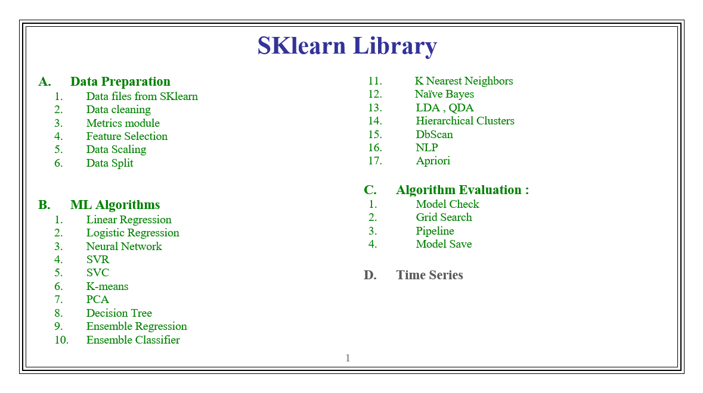

# scikit-learn-library-for-machine-learning

I depend on [Scikit-learn 0.24.1 (stable) documentation](https://scikit-learn.org/0.24/) [(Download ZIP 66.7 MB)](https://scikit-learn.org/stable//_downloads/scikit-learn-docs.zip)
and for file arrange i depend on [( 10 القسم العاشر : مكتبة سايكيتليرن Sklearn Library )](https://www.youtube.com/playlist?list=PL6-3IRz2XF5X_9JeJh1xeciAbkijvc09k) youtube playlist made by [Hesham Asem](https://github.com/HeshamAsem)

---

